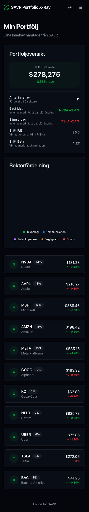
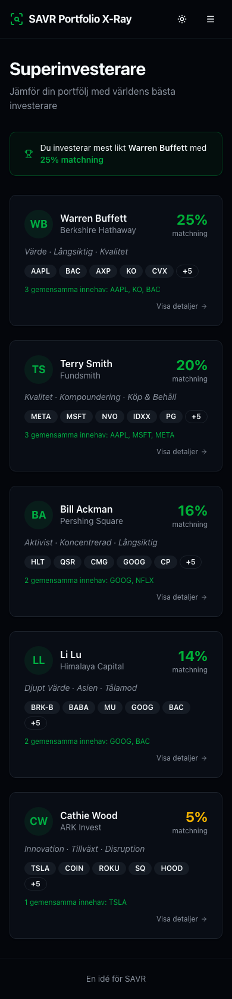
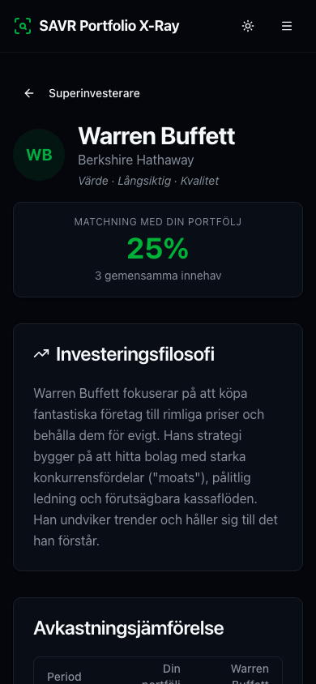
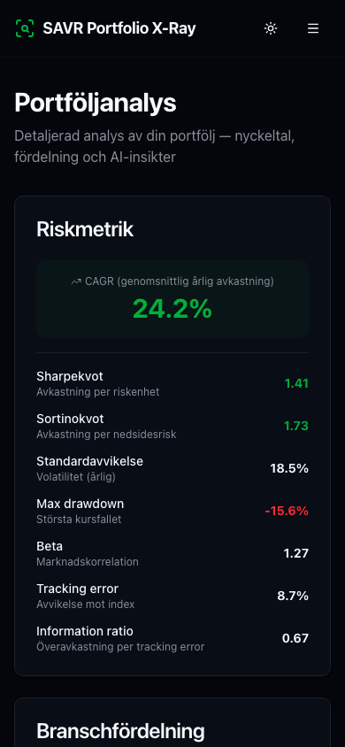
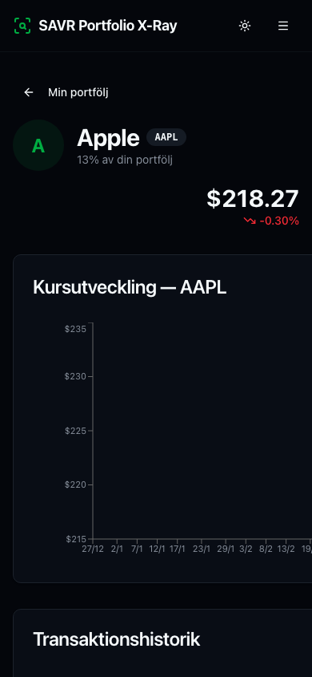

# SAVR Portfolio X-Ray

**Röntga din portfölj — jämför med världens bästa investerare och få AI-driven analys.**

**[Live Demo — savr.konstantin.app](https://savr.konstantin.app)**

Många investerare undrar: _"Hur bra är egentligen min portfölj?"_ Portfolio X-Ray ger svaret genom att jämföra dina innehav med kända superinvesterare som Warren Buffett, Bill Ackman och Cathie Wood — och sedan analysera din portfölj med AI.

Resultatet? En funktion som gör SAVR till mer än en handelsplattform — det blir en **investeringscoach**.

---

## Funktioner

### Portföljöversikt

- Portföljvärde med daglig förändring
- Nyckeltal i realtid (P/E, Beta, bäst/sämst idag)
- Interaktiva aktiekort med prisgrafer och köp/sälj-markeringar

### Superinvesterare

- 5 investerarprofiler med filosofi, topp-innehav och sektorfördelning
- Matchningspoäng — hur likt investerar du jämfört med varje investerare?
- Avkastningsjämförelse (YTD, 1/3/5/10 år) med kumulativ graf
- Detaljerad jämförelsetabell med klickbara aktier

### Portföljanalys

- Riskmetrik: CAGR, Sharpekvot, Sortinokvot, standardavvikelse, max drawdown
- Sektor-, land- och valutafördelning med interaktiva diagram
- Köp/sälj-aktivitet per månad
- **AI-analys** — personlig genomgång med styrkor, svagheter, konkreta förbättringsförslag och ett betyg

### Aktiesidor

- Prisutveckling med interaktiv graf och köp/sälj-markeringar
- Nyckeltal (P/E, marknadsvärde, beta, direktavkastning, m.m.)
- Vilka superinvesterare som äger aktien
- Transaktionshistorik och nyheter

---

## Kundnytta för SAVR

| Värde               | Beskrivning                                                                        |
| ------------------- | ---------------------------------------------------------------------------------- |
| **Engagemang**      | Användare återkommer för att se hur portföljen utvecklas vs. superinvesterarna     |
| **Utbildning**      | Hjälper investerare förstå portföljkoncept som diversifiering, beta och Sharpekvot |
| **Differentiering** | Ingen annan svensk plattform erbjuder jämförelse med superinvesterare              |
| **Retention**       | Återkommande insikter skapar vana och lojalitet                                    |

---

## Kommersiell gångbarhet

- **Freemium-modell** — grundläggande matchning gratis, AI-analys och detaljerade jämförelser som premiumfunktion
- **Ökat AUM** — användare inspireras att investera mer och bredare
- **Retention** — personliga insikter ger anledning att återkomma
- **Data-insikter** — vilka investerare vill kunderna efterlikna? Vilka aktier inspirerar mest?

---

## Genomförbarhet

Appen är byggd med modern teknik som enkelt integreras med SAVR:s befintliga plattform:

- **Portföljdata** hämtas idag hårdkodat — ersätts med SAVR:s befintliga API
- **Superinvesterardata** kan hämtas automatiskt från SEC:s offentliga 13F-filings
- **AI-analysen** använder Google Gemini men kan bytas till valfri LLM
- **Modulära komponenter** — varje del kan integreras stegvis utan att påverka befintlig funktionalitet

---

## Tech stack

React 19, TypeScript, Vite, Tailwind CSS v4, shadcn/ui, TanStack Router + Query + Table, Recharts, Zod, Google Gemini API

---

## Kom igång

```bash
pnpm install
cp .env.example .env  # Lägg till din Gemini API-nyckel
pnpm dev
```

Appen fungerar fullt ut utan API-nyckel — AI-analysen kräver en gratis [Google Gemini API-nyckel](https://aistudio.google.com/apikey).

---

## Screenshots

|                    Min Portfölj                     |                     Superinvesterare                     |                      Investerarjämförelse                      |                     Portföljanalys                      |                      Aktiesida                       |
| :-------------------------------------------------: | :------------------------------------------------------: | :------------------------------------------------------------: | :-----------------------------------------------------: | :--------------------------------------------------: |
|  |  |  |  |  |
